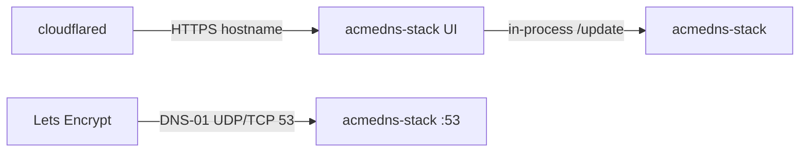

# Wiki

How public DNS, port 53, and this stack fit together. The [README](../README.md) is the operator guide; these pages are the networking story behind DNS-01.

## Pages

- [Working Synology setup](Working-Synology-setup.md) — runbook that issued certs on the NAS (`config.cfg`, Cloudflare, reverse proxy, ports, proven CNAME chain)
- [Test this stack on the Synology](Test-on-Synology.md) — DMZ owns public 53; Mac Compose cannot prove DNS-01
- [Public DNS and port 53](Public-DNS-and-port-53.md) — why Let's Encrypt must reach this box on 53
- [Macvlan for port 53](Macvlan-port-53.md) — dedicated IP when the host already owns `:53`
- [VPS port 53](VPS-port-53.md) — bind `:53` to the public/NIC IPv4 when `0.0.0.0:53` collides with resolved
- [Hostnames do not split ports](Hostnames-do-not-split-ports.md) — A records, glue, email as an analogy
- [DMZ, Synology, and Mac](DMZ-Synology-and-Mac.md) — where public `:53` actually lands
- [Cloudflared and DNS](Cloudflared-and-DNS.md) — why the tunnel feels magical and still cannot carry DNS-01
- [Certificate checklist](Certificate-checklist.md) — CNAME, glue, forward, then Apply in the Certs UI

## Two paths

The UI talks to acme-dns **in-process** inside `acmedns-stack` (or over HTTP for an external server). Let's Encrypt does **not**. Validators only do a public DNS lookup. Those two paths are easy to mix up.

HTTP UI traffic can go through cloudflared. Port 53 cannot.
