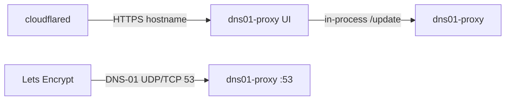
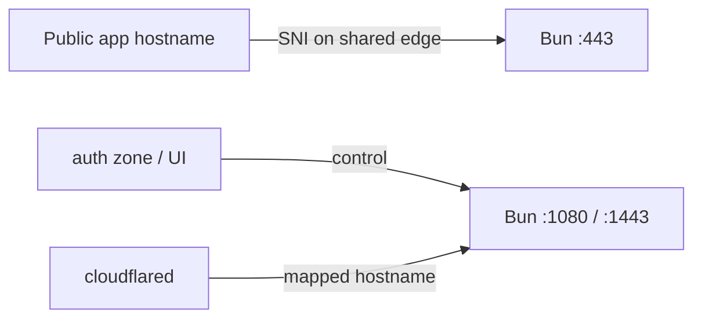

# Wiki

How public DNS, port 53, and the Bun edge proxy fit this stack. The [README](../README.md) is the operator guide; these pages are the networking and SSL story behind DNS-01 and Proxy Hosts.

## Repo layout

| Path | Role |
| --- | --- |
| `src/dns01-proxy/` | Nuxt app: DNS `:53`, acme-dns API, operator UI, Certs, Proxy Hosts, `seed/` |
| `./dc.sh` | Root helpers — `up`, `down`, `build`, `dev`, `vps`, … (no root `package.json`) |
| `docker-compose.yml.example` | Production service `dns01-proxy` → image `harianto/dns01-proxy` |
| `_build.yml` / `_push.yml` / `_dev.yml` / `_vps.yml` | Build, Hub push, hot-reload, VPS `:53` bind |
| `./data/dns01-proxy` → `/var/lib/dns01-proxy` | Live data: `server/`, `client/`, `backup/` |
| `./data/letsencrypt` → `/etc/letsencrypt` | PEMs (`live/`, `staging/`, …) |

Local Nuxt (no Docker): `bun install --cwd src/dns01-proxy` then `bun run --cwd src/dns01-proxy dev`. Compose: copy the example files, then `./dc.sh up` (or `./dc.sh dev` for hot-reload).

## Pages

- [Bun proxy and SSL](Proxy-SSL.md) — shared `:80`/`:443`, SSL Certificate vs Inherited SSL, nested admin SNI
- [Tiny stack (shared mode)](Tiny-stack.md) — slim auth zone without Register UI
- [Working Synology setup](Working-Synology-setup.md) — runbook that issued certs on the NAS
- [Test this stack on the Synology](Test-on-Synology.md) — DMZ owns public 53; Mac Compose cannot prove DNS-01
- [Public DNS and port 53](Public-DNS-and-port-53.md) — glue, why Let's Encrypt must reach this box on 53
- [VPS port 53](VPS-port-53.md) — bind `:53` to the public/NIC IPv4 when `0.0.0.0:53` collides with resolved
- [Cloudflared and DNS](Cloudflared-and-DNS.md) — tunnel is HTTPS only; it cannot carry DNS-01
- [Certificate checklist](Certificate-checklist.md) — CNAME, glue, forward, then Apply in the Certs UI

## Two paths (DNS-01)

The UI talks to acme-dns **in-process** inside `dns01-proxy` (or over HTTP for an external server). Let's Encrypt does **not**. Validators only do a public DNS lookup. Those two paths are easy to mix up.

HTTP UI traffic can go through cloudflared. Port 53 cannot.

## Two HTTPS paths (apps)

Public Proxy Hosts use the shared edge ([Bun proxy and SSL](Proxy-SSL.md)). Auth / operator traffic uses the control ports (or the tunnel).
