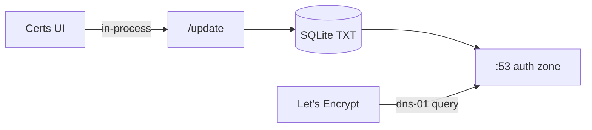

# Tiny stack (shared mode)

Slim deployment: **no Register step**, **no `clientstorage.json` accounts** for each apex. You publish one **deterministic** CNAME per certificate apex and issue from the **Certs** UI.

Encoding: `mdstn.com` → `_mdstn-com_` (dots become hyphens, wrap in underscores).

Full stack docs: [Certificate checklist](Certificate-checklist) (UUID + Register flow).

## What you do vs what the server does

| You (once per apex) | Server (automatic) |
| --- | --- |
| CNAME `_acme-challenge.mdstn.com` → `_mdstn-com_.auth.uti.email` | Publishes dns-01 TXT under `_mdstn-com_` during Apply |
| Lines in `domains.txt` (Certs UI) | Renews production certs on a timer |
| Delegate NS for the auth zone at your registrar (e.g. Cloudflare) | Fills glue **A** (+ **AAAA** if IPv6 is detected) + **NS** at boot |
| Open port **53** on the host running this stack | Answers Let's Encrypt DNS queries for any `<uuid\|_label_>.auth.zone` |

**You do not add** `ACMEDNS_SHARED_KEY`, API passwords, or challenge TXT records in Cloudflare for your real domains.

## DNS at Cloudflare (example)

Auth zone: `auth.uti.email` (set via `ACMEDNS_TINY_DOMAIN`).

**On the auth zone** (parent zone `uti.email`): grey-cloud **A** / **NS** glue so the world reaches your server on `:53`. In tiny mode those glue lines in `config.cfg` are **auto-filled** from your public IP unless you pin `ACMEDNS_PUBLIC_IP` / `ACMEDNS_PUBLIC_IPV6`. The zone apex stays **NS + A/AAAA** — never a CNAME.

**On each site you certificate**:

| Apex | Cloudflare CNAME Content |
| --- | --- |
| `mdstn.com` | `_mdstn-com_.auth.uti.email` |
| `sylo.space` | `_sylo-space_.auth.uti.email` |

| Type | Name | Content | Proxy |
| --- | --- | --- | --- |
| CNAME | `_acme-challenge` | `_mdstn-com_.auth.uti.email` | DNS only (grey cloud) |

Zone file form:

```dns
_acme-challenge.mdstn.com.  CNAME  _mdstn-com_.auth.uti.email.
_acme-challenge.sylo.space. CNAME  _sylo-space_.auth.uti.email.
```

**DNS setup** (`/domains`) shows the exact Content string per apex.

Nested wildcards on the same cert line still use the **full stack** CNAME chain (`_acme-challenge.oib.mdstn.com` → `_acme-challenge.mdstn.com`). See [Public DNS and port 53](Public-DNS-and-port-53).

**Migration:** Older tiny installs that CNAME’d to the auth zone apex (`auth.uti.email`) must update each site to the encoded label. Shared apex TXT caused collisions across domains.

## Minimal `.env`

```bash
ACMEDNS_TINY_DOMAIN=auth.uti.email
LETSENCRYPT_EMAIL=you@example.org
```

Optional first-start seed:

```bash
NUXT_ACME_DNS_DEFAULT_CONFIG=seed/server/config.tiny.cfg
```

When `ACMEDNS_TINY_DOMAIN` is set and `ACMEDNS_URL` is omitted, the public URL defaults to `https://<tiny-domain>`.

## Environment variables (tiny)

| Variable | Required? | Purpose |
| --- | --- | --- |
| `ACMEDNS_TINY_DOMAIN` | **Yes** (recommended) | Auth zone hostname. Overrides `config.cfg` `domain` + `nsname`; turns on shared mode. |
| `LETSENCRYPT_EMAIL` | **Yes** | ACME account contact. |
| `ACMEDNS_URL` | No | Public HTTP identity. Defaults to `https://<ACMEDNS_TINY_DOMAIN>`. |
| `ACMEDNS_SHARED_KEY` | No | See [Shared API key](#shared-api-key-acmedns_shared_key) below. |
| `ACMEDNS_SHARED_MODE` | No | Force shared mode without `ACMEDNS_TINY_DOMAIN` (uses `domain` from `config.cfg`). |
| `ACMEDNS_PUBLIC_IP` | No | Pin glue **A** record. Auto-detected when omitted. |
| `ACMEDNS_PUBLIC_IPV6` | No | Pin glue **AAAA** record. Added when detected or set. |
| `NUXT_ACME_DNS_DEFAULT_CONFIG` | No | Use `seed/server/config.tiny.cfg` on first boot. |

Everything else (`ACMEDNS_DATA_ROOT`, `RENEW_INTERVAL`, `ADMINISTRATOR_PASSWORD`, …) is the same as the full stack. See root [README](../README.md).

## Shared API key (`ACMEDNS_SHARED_KEY`)

### What it is

A **40-character internal password** for the acme-dns **`POST /update`** API. It lets a client **write** the dns-01 TXT on your auth zone. Let's Encrypt never sees this key; it only queries public DNS on port 53.

In tiny mode there is **one** shared account (fixed username `00000000-0000-4000-8000-000000000001`) instead of one password per domain. TXT labels are **per-apex** (`_mdstn-com_`, or any UUID / `_label_` under the auth zone).

### What it is not

- **Not** a DNS record — do not add it in Cloudflare.
- **Not** something you paste into `_acme-challenge` TXT.
- **Not** required for the all-in-one container when you use the **Certs** UI.

### Why the mechanism exists

Classic [acme-dns](https://github.com/acme-dns/acme-dns) separates:

1. **DNS server** — authoritative for `*.auth.example.org`, answers LE.
2. **HTTP `/update`** — cert tooling publishes TXT without API access to Cloudflare/Route53.

Tiny mode keeps `/update` but drops **Register** (no UI passwords / `clientstorage`).

### All-in-one flow (omit `ACMEDNS_SHARED_KEY`)



On first boot the server generates a random 40-char key and stores it in SQLite (`shared_password` in the `acmedns` table). Issuance uses it internally. **You can leave `ACMEDNS_SHARED_KEY` unset.**

### When to set `ACMEDNS_SHARED_KEY`

| Situation | Set it? |
| --- | --- |
| Single Docker container, Certs UI only | **No** |
| Fresh volume every deploy, no UI issuance | Optional — pin so external tools keep working |
| External certbot / script calls `https://auth.uti.email/update` | **Yes** — same key on client and server |
| Manual debugging with `curl` | Optional — or read generated key from DB / logs |

Example (advanced):

```bash
# Exactly 40 chars: A–Z a–z 0–9 - _
ACMEDNS_SHARED_KEY=AbCdEfGhIjKlMnOpQrStUvWxYz0123456789-_
```

Manual `/update` (only if you set or know the key). Use the encoded apex label (not the auth zone first label):

```bash
curl -sS -X POST "https://auth.uti.email/update" \
  -H "X-Api-User: 00000000-0000-4000-8000-000000000001" \
  -H "X-Api-Key: YOUR_40_CHAR_KEY" \
  -H "Content-Type: application/json" \
  -d '{"subdomain":"_mdstn-com_","txt":"PLACEHOLDER_43_CHAR_DNS01_TOKEN"}'
```

### Priority at boot

1. `ACMEDNS_SHARED_KEY` (env)
2. `shared_password` in `config.cfg`
3. Value already stored in SQLite
4. Generate new random key

## Full stack vs tiny

| | Full stack | Tiny stack |
| --- | --- | --- |
| Register in UI | Yes | No |
| CNAME target | `{uuid}.auth.zone` (from Register) | `_encoded-apex_.auth.zone` (deterministic) |
| `clientstorage.json` | Per-apex credentials | Not needed |
| `ACMEDNS_SHARED_KEY` | N/A (per-domain passwords) | Optional (one shared key) |
| Many SANs / nested wildcards | 100 TXT slots per UUID | 100 TXT slots per apex label |

Each apex has its own TXT namespace, so parallel issuance across domains is fine.

**Note:** `foo-bar.com` and `foo.bar.com` both encode to `_foo-bar-com_` — avoid colliding apex encodings.

## Operator checklist

1. Set `ACMEDNS_TINY_DOMAIN` and `LETSENCRYPT_EMAIL`.
2. Ensure public **UDP/TCP 53** reaches this host ([Public DNS and port 53](Public-DNS-and-port-53)).
3. Delegate **NS** for the auth zone; let boot fill **A** / **AAAA** or set `ACMEDNS_PUBLIC_IP`.
4. Add certificate lines in **Certs** (Save).
5. Add CNAME `_acme-challenge.<apex>` → `_&lt;apex-with-dashes&gt;_.<ACMEDNS_TINY_DOMAIN>` from **DNS setup** (DNS only).
6. **Apply** (staging first if you prefer).

The **Register** page, nav button, and modal are hidden in tiny mode; `/register` redirects to DNS setup.

## Related

- [Cloudflared and DNS](Cloudflared-and-DNS) — HTTP via tunnel; DNS still needs public `:53`.
- [Working Synology setup](Working-Synology-setup) — production NAS runbook (full or tiny).
- [Hostnames do not split ports](Hostnames-do-not-split-ports) — why glue A + NS matter.
