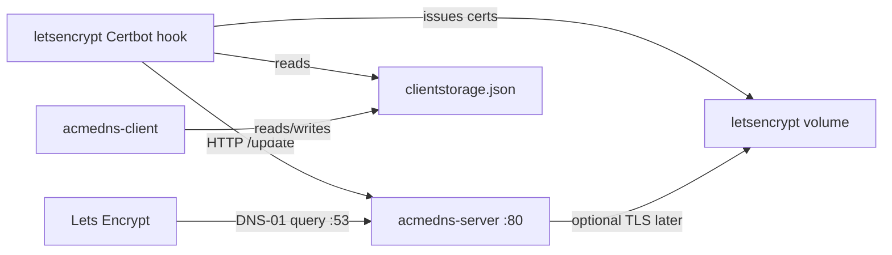

# ACME DNS stack

Self-hosted [acme-dns](https://github.com/joohoi/acme-dns) plus automated Let's Encrypt certificates. Three related services run from one `docker-compose.yml`.

`.original/` is a gitignored snapshot of the old per-folder server layouts. Do not run those compose files from here.

## Why this exists

Let's Encrypt never reads `clientstorage.json`. Official Certbot stores certificates and ACME accounts under `/etc/letsencrypt/` (`live/`, `archive/`, `renewal/`, `accounts/`). The JSON file in this stack is **acme-dns API credentials** — username, password, subdomain — so a DNS-01 hook can update TXT records. Let's Encrypt only queries public DNS for `_acme-challenge`.

There is a Certbot DNS plugin for this: [`certbot-dns-acmedns`](https://pypi.org/project/certbot-dns-acmedns/) ([source](https://github.com/pan-net-security/certbot-dns-acmedns)). It is **not** an official Let's Encrypt plugin (those are `certbot-dns-cloudflare`, `certbot-dns-route53`, and so on). It is a third-party authenticator with a long name (`certbot-dns-acmedns:dns-acmedns`), a separate credentials INI, and a registration JSON it will **not** create for you.

That JSON is the same shape used by [acme-dns-client](https://github.com/acme-dns/acme-dns-client) (`/etc/acmedns/clientstorage.json`), the [joohoi Certbot hook](https://github.com/joohoi/acme-dns-certbot-joohoi) (`acmedns.json`), and [cert-manager](https://cert-manager.io/docs/configuration/acme/dns01/acme-dns/).

This stack skips the plugin. The custom `letsencrypt` image runs Certbot `--manual` with `acme-dns-auth.py`, reads `clientstorage.json` from the shared volume, talks to `acmedns-server` on the compose network, and loops over `domains.txt`. Same DNS-01 path, fitted to this compose layout instead of the plugin's INI + JSON split.

The `acmedns-client` UI (`harianto/acme-clientstorage`) is there to edit that JSON without SSH.



| Service | Role |
| --- | --- |
| `acmedns-server` | Limited DNS server plus HTTP register/update API ([joohoi/acme-dns](https://github.com/joohoi/acme-dns)) |
| `acmedns-client` | Web UI for `clientstorage.json` (`harianto/acme-clientstorage:latest`) |
| `letsencrypt` | Custom Certbot image: auth hook, `domains.txt`, auto-renew — not the `certbot-dns-acmedns` plugin |

## Exposed ports

### `acmedns-server`

| Container port | Protocol | Published on host | Purpose |
| --- | --- | --- | --- |
| `53` | TCP | **yes** — `53:53` | DNS (Let's Encrypt DNS-01 lookups) |
| `53` | UDP | **yes** — `53:53/udp` | DNS (Let's Encrypt DNS-01 lookups) |
| `80` | TCP | **no** | HTTP API (`/register`, `/update`, health). Reachable on the compose network as `http://acmedns-server` and via the `cloudflared` bridge |
| `443` | TCP | **no** | Listed on the image (`EXPOSE 443`). Unused while `tls = "none"` in `config.cfg` |

Do not publish host `:80` or `:443` for this service. The API is meant to stay on the Docker / Cloudflare tunnel network.

### `acmedns-client`

| Container port | Protocol | Published on host | Purpose |
| --- | --- | --- | --- |
| `3000` | TCP | **yes** — `82:3000` | Clientstorage web UI at `http://localhost:82` |

Also attached to `cloudflared`, so the UI can be served through a tunnel hostname instead of (or as well as) host port 82.

### `letsencrypt`

| Container port | Protocol | Published on host | Purpose |
| --- | --- | --- | --- |
| — | — | **none** | Certbot talks outbound to Let's Encrypt and to `http://acmedns-server`. No inbound ports |

## Quick start

```bash
cp .env.example .env
mkdir -p data/acmedns-server/config data/acmedns-server/data data/acmedns-letsencrypt
cp build/acmedns-server/config.cfg.example data/acmedns-server/config/config.cfg
cp build/acmedns-letsencrypt/domains.txt.example data/acmedns-letsencrypt/domains.txt
```

1. Edit `data/acmedns-server/config/config.cfg` — set `domain`, `nsname`, `nsadmin`, and the public `A` record IP.
2. Edit `data/acmedns-letsencrypt/domains.txt` — one domain per line; optional wildcard as the second column. Lines starting with `#` or `;` are comments.
3. Edit `.env` — set `LETSENCRYPT_EMAIL` and review the other variables (see below).
4. Point `_acme-challenge.<domain>` CNAMEs at the `fulldomain` values from `clientstorage.json`.
5. Ensure the `cloudflared` Docker network exists (used by `docker-compose.override.yml`).
6. Start:

```bash
docker compose up -d --build
```

## Configuration

| Path | Notes |
| --- | --- |
| `.env` | All Compose environment variables. Gitignored; copy from `.env.example` |
| `data/acmedns-server/config/config.cfg` | acme-dns listen address, zone, and API (`tls = "none"`, API port `80` in the example) |
| `data/acmedns-letsencrypt/domains.txt` | Certificate names for Certbot |
| `clientstorage.json` (named volume `acmedns-client`) | acme-dns accounts, not Let's Encrypt data |

### Environment variables

Used by the `letsencrypt` service (`docker-compose.yml` interpolates these from `.env`):

| Variable | Example | Purpose |
| --- | --- | --- |
| `ACMEDNS_URL` | `http://acmedns-server` | acme-dns HTTP API for new registrations. Existing `clientstorage.json` accounts may still use their own `server_url` |
| `STORAGE_PATH` | `/config/acmedns-client/clientstorage.json` | Path to `clientstorage.json` inside the letsencrypt container |
| `LETSENCRYPT_EMAIL` | `admin@example.com` | Contact email for Let's Encrypt |
| `RENEW_INTERVAL` | `12` | Hours between Certbot renewal checks |
| `TZ` | `UTC` | Container timezone |

`acmedns-server` and `acmedns-client` have no Compose environment variables; the server is configured via `config.cfg`.

## Volumes

| Volume | Used by | Path in container |
| --- | --- | --- |
| `letsencrypt` (named) | `letsencrypt` (rw), `acmedns-server` (ro) | `/etc/letsencrypt` |
| `acmedns-client` (named) | `acmedns-client` (rw), `letsencrypt` (ro) | `/app/data` and `/config/acmedns-client` |
| `letsencrypt-logs` (named) | `letsencrypt` | `/var/log/certbot` |
| `./data/acmedns-server/config` | `acmedns-server` | `/etc/acme-dns` (ro) |
| `./data/acmedns-server/data` | `acmedns-server` | `/var/lib/acme-dns` (sqlite) |
| `./data/acmedns-letsencrypt/domains.txt` | `letsencrypt` | `/config/domains.txt` (ro) |

Other stacks can mount the named volumes with `external: true` if they need the same certificates or client storage.

## Networks

- **default** (`acmedns-stack_default`) — all three services. Certbot uses this to reach `http://acmedns-server`.
- **cloudflared** (external) — `acmedns-server` and `acmedns-client` only, via `docker-compose.override.yml`. DNS port 53 is not tunneled.

## Layout

```
docker-compose.yml
docker-compose.override.yml
.env.example
build/acmedns-server/          # Dockerfile + config.cfg.example
build/acmedns-letsencrypt/     # custom Certbot hook (not certbot-dns-acmedns)
data/                          # gitignored runtime config
```
