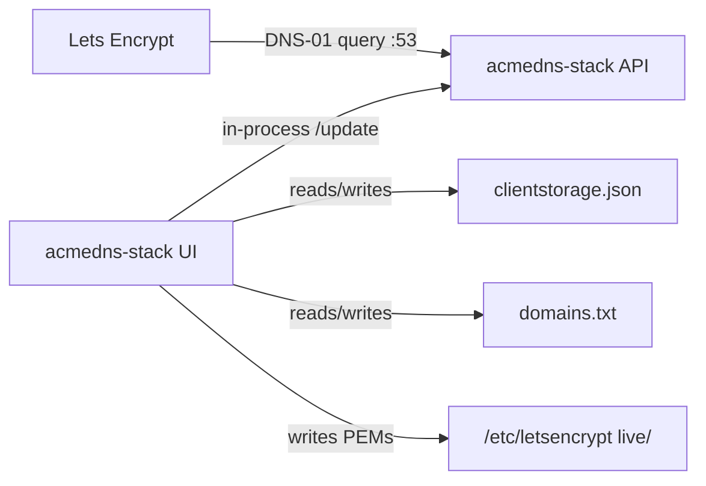

# ACME DNS stack

One container. DNS-01 certificates without giving Let's Encrypt (or anyone) write access to your real DNS.

| Service | What it does |
| --- | --- |
| `acmedns-stack` | Nuxt/Node [acme-dns](https://github.com/acme-dns/acme-dns) on `:53` **plus** operator UI, clientstorage, and ACME issue/renew (`plugins/client`) |

`build/acmedns-server` (Go) and `build/acmedns-client` stay in the tree as reference/rollback. Runtime compose is a single service.



## Storage layout

| Role | Production (`ACMEDNS_DATA_ROOT`) | Local `bun run dev` |
| --- | --- | --- |
| Server config + SQLite | `/var/lib/acmedns-stack/server/` | `.data/server/` |
| clientstorage, domains, cert settings | `/var/lib/acmedns-stack/client/` | `.data/client/` |
| JSON backups | `/var/lib/acmedns-stack/backup/` | `.data/backup/` |
| Let's Encrypt PEMs | `/etc/letsencrypt/` (`ACMEDNS_LETSENCRYPT_DIR`) | `.data/letsencrypt/` |

First start copies missing files from [`build/acmedns-stack/seed/`](build/acmedns-stack/seed/README.md). Live files are never overwritten. Edit `seed/` to change defaults for **new** installs.

Compose example binds:

```yaml
volumes:
  - ./data/acmedns-stack:/var/lib/acmedns-stack   # or /var/lib/acmedns-stack:/var/lib/acmedns-stack
  - ./data/letsencrypt:/etc/letsencrypt            # or named volume letsencrypt
```

## Certificates

Edit `domains.txt` on the host (`…/client/domains.txt`) or in the **Certs** UI. **Save** validates format only. **Apply** runs ACME (DNS-01 via acme-dns).

- **Production** (default) writes `/etc/letsencrypt/live/<cert-name>/`
- **Staging** writes `/etc/letsencrypt/staging/<cert-name>/` and never touches `live/`
- A renew timer refreshes **production** certs within ~30 days of expiry
- Removing a line from `domains.txt` leaves PEMs on disk (orphans). Use **Trash** → Undo or permanent delete

Consumers mount the PEM tree read-only:

```yaml
volumes:
  - ./data/letsencrypt:/etc/letsencrypt:ro
```

Upstream acme-dns only keeps two TXT records per account. This stack’s Nuxt server keeps **100 rolling TXT slots**. Rebuild `acmedns-stack` when issuing many SANs on one account.

`domains.txt` expands nested wildcards (implied parent wildcards). Line order does not matter — shortest apex is the cert-name. Register the line apex in the UI; the issuer walks parent keys in `clientstorage.json`.

### Tiny stack (no Register)

For a slim setup — no Register UI; CNAME `_acme-challenge.<apex>` → `_encoded-apex_.<auth zone>` — see [`.wiki/Tiny-stack.md`](.wiki/Tiny-stack.md). Minimal env: `ACMEDNS_TINY_DOMAIN` + `LETSENCRYPT_EMAIL`. **`ACMEDNS_SHARED_KEY` is optional** (internal `/update` password; auto-generated for the all-in-one UI).

## Ports

| Container | Host | Notes |
| --- | --- | --- |
| `53/tcp` | `53` | DNS. Let's Encrypt hits this. |
| `53/udp` | `53` | Same. |
| `80/tcp` | `8080` | UI + register/update API (always). |
| `443/tcp` | `8443` | Same API over HTTPS when `api.tls = "cert"`. |

DNS has to be public; keep the UI behind your LAN / tunnel.

This house’s router DMZ is the Synology, so public `:53` never reaches a Mac. **Test real Let's Encrypt issuance on the NAS**, not on a laptop. See [`.wiki/Test-on-Synology.md`](.wiki/Test-on-Synology.md). Working NAS runbook: [`.wiki/Working-Synology-setup.md`](.wiki/Working-Synology-setup.md).

## Quick start

```bash
cp .env.example .env
cp docker-compose.yml.example docker-compose.yml
cp docker-compose.override.yml.example docker-compose.override.yml
bun run docker:up
# or: docker compose up -d --build
```

Useful root scripts (`package.json`): `dev`, `build`, `typecheck`, `docker:build`, `docker:push`, `docker:up` / `docker:dev` / `down` / `logs`.

Docker Nuxt hot-reload (compose profile `dev`, UI on `:3000`, DNS on `:15353`):

```bash
bun run docker:dev
# or: docker compose --profile dev up acmedns-stack-dev
```

Requires a local `docker-compose.yml` copied from the `.example` (same as production). Does not start the production `acmedns-stack` image.

On first start the image seeds under `$ACMEDNS_DATA_ROOT` (`server/`, `client/`, `backup/`) and uses `$ACMEDNS_LETSENCRYPT_DIR` for PEMs.

1. Edit `server/config.cfg` — auth hostname, NS, admin, public IP.
2. Edit `client/domains.txt` — one certificate per line (or use Certs UI). Example: `mdstn.com *.mdstn.com *.oib.mdstn.com`. `#` and `;` start comments.
3. `.env` — at least `LETSENCRYPT_EMAIL`.
4. CNAME `_acme-challenge.<apex>` → `fulldomain` in `clientstorage.json`. Nested zones CNAME to `_acme-challenge.<apex>`.
5. Attach the `cloudflared` Docker network (see `docker-compose.override.yml.example`).

Manual migrate from older layouts: move server config/DB into `…/server/`, client files into `…/client/`, backups into `…/backup/`, PEMs into the letsencrypt mount.

## Config

| File | |
| --- | --- |
| `.env` | Copy from `.env.example`. Gitignored. |
| `docker-compose.yml` | Copy from `docker-compose.yml.example`. Gitignored. |
| `docker-compose.override.yml` | Copy from `docker-compose.override.yml.example`. Gitignored. |
| `$ACMEDNS_DATA_ROOT/server/config.cfg` | Listen address, zone, API, SQLite path. |
| `$ACMEDNS_DATA_ROOT/client/domains.txt` | What to issue (also edited in the Certs UI). |
| `$ACMEDNS_DATA_ROOT/client/clientstorage.json` | acme-dns logins. Not Let's Encrypt. |

### Environment (path vars)

| Variable | Production | Development |
| --- | --- | --- |
| `ACMEDNS_DATA_ROOT` | `/var/lib/acmedns-stack` | `.data` |
| `ACMEDNS_LETSENCRYPT_DIR` | `/etc/letsencrypt` | `.data/letsencrypt` |

No other path ENV names. Everything else is derived (`server/`, `client/`, `backup/`).

### Environment (other)

| Variable | Example | |
| --- | --- | --- |
| `ACMEDNS_URL` | `https://auth.example.org` | Public identity for register/update. Loopback or a host matching `config.cfg` `domain` still runs in-process. |
| `ACMEDNS_TINY_DOMAIN` | `auth.uti.email` | **Tiny only.** Auth zone; enables shared mode. See [`.wiki/Tiny-stack.md`](.wiki/Tiny-stack.md). |
| `ACMEDNS_SHARED_KEY` | _(omit)_ | **Tiny advanced.** Internal `/update` API password — not DNS. Auto-generated if unset. |
| `ACMEDNS_PUBLIC_IP` | _(auto)_ | **Tiny.** Glue A record for auth zone. |
| `ACMEDNS_PUBLIC_IPV6` | _(auto)_ | **Tiny.** Glue AAAA when IPv6 is available. |
| `LETSENCRYPT_EMAIL` | `admin@example.com` | ACME account contact. |
| `RENEW_INTERVAL` | `12` | Hours between production renew checks. |
| `CERTS_ACME_DISABLED` | `false` | Set `true` to disable production issue/renew (staging Apply still works). Overridable in Settings → `client/app-settings.json`. |
| `TZ` | `UTC` | Clock. |
| `ADMINISTRATOR_PASSWORD` | _(empty)_ | Lock UI behind username `admin`. |

## Networks

Single `acmedns-stack` service. HTTP on `:80` is always on; set `api.tls = "cert"` in `config.cfg` to also serve HTTPS on `:443` (host `8443`).

`cloudflared` (external): attach the same service. Port 53 stays on the host, not the tunnel.

More on DNS-01 and DMZ: [`.wiki/Home.md`](.wiki/Home.md).

## Layout

```
docker-compose.yml.example
docker-compose.build.yml      # local image build
docker-compose.push.yml       # multi-arch Hub push
.env.example
.wiki/
build/acmedns-stack/           # DNS + API + UI plugin + seed/
build/acmedns-server/         # Go reference / rollback
build/acmedns-client/         # legacy standalone client (reference)
```
