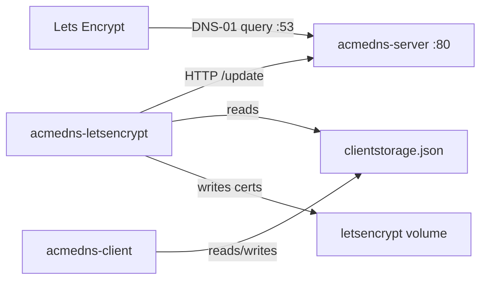

# ACME DNS stack

Three containers. One compose file. Certificates via DNS-01 without giving Let's Encrypt (or anyone) write access to your real DNS.

| Service | What it does |
| --- | --- |
| `acmedns-server` | [acme-dns](https://github.com/joohoi/acme-dns) — a tiny DNS server plus an HTTP API for TXT updates |
| `acmedns-client` | A small UI I made (`harianto/acme-clientstorage`) so I can edit `clientstorage.json` in a browser |
| `acmedns-letsencrypt` | Certbot in a loop. Custom hook, not the plugin |



## Why I didn't just use the plugin

There *is* a Certbot plugin: [`certbot-dns-acmedns`](https://pypi.org/project/certbot-dns-acmedns/). It is not from Let's Encrypt. Official plugins look like `certbot-dns-cloudflare`. This one is third-party, wants a credentials INI *and* a JSON file, and it will not register the acme-dns accounts for you.

That JSON is the same idea as `clientstorage.json`. [acme-dns-client](https://github.com/acme-dns/acme-dns-client) calls it that. Joohoi's hook calls it `acmedns.json`. cert-manager uses the same shape. Let's Encrypt never touches any of it. They only look up `_acme-challenge` in public DNS. Certbot's own stuff lives under `/etc/letsencrypt/`.

I got tired of the plugin. So `acmedns-letsencrypt` is just Certbot `--manual` with `acme-dns-auth.py`, reading the JSON from a shared volume, talking to `acmedns-server`, and walking `domains.txt`. Same challenge, less ceremony.

## Ports

### `acmedns-server`

| Container | Host | Notes |
| --- | --- | --- |
| `53/tcp` | `53` | DNS. Let's Encrypt hits this. |
| `53/udp` | `53` | Same. |
| `80/tcp` | not published | Register/update API. Compose DNS name `http://acmedns-server`, or cloudflared. |
| `443/tcp` | not published | Image exposes it. Unused while `tls = "none"`. |

Leave `:80` and `:443` off the host. DNS has to be public; the API does not.

### `acmedns-client`

| Container | Host | Notes |
| --- | --- | --- |
| `3000/tcp` | `82` | UI at `http://localhost:82`. Also on cloudflared if you want a hostname. |

### `acmedns-letsencrypt`

Nothing published. It only talks out: Let's Encrypt, and `http://acmedns-server`.

## Quick start

```bash
cp .env.example .env
docker compose up -d --build
```

Docker creates `data/` for you. On first start the containers write:

- `data/acmedns-server/config/config.cfg`
- `data/acmedns-letsencrypt/domains.txt`
- `clientstorage.json` on the `acmedns-client` volume (`{}` if empty), written by `acmedns-client`

Edit those, then restart. `domains.txt` ships as comments only so Certbot does not try `example.com` by accident.

If an old compose file already bind-mounted a missing `domains.txt`, Docker may have created a *directory* with that name. Remove it (`rm -rf data/acmedns-letsencrypt/domains.txt`) and start again.

1. `config.cfg` — your auth hostname, NS, admin, public IP.
2. `domains.txt` — one domain per line, optional `*.domain` next to it. `#` and `;` start comments.
3. `.env` — at least `LETSENCRYPT_EMAIL`.
4. CNAME `_acme-challenge.<domain>` to the `fulldomain` in `clientstorage.json`.
5. You need the `cloudflared` Docker network (see `docker-compose.override.yml`).

## Config

| File | |
| --- | --- |
| `.env` | Copy from `.env.example`. Gitignored. |
| `data/acmedns-server/config/config.cfg` | Listen address, zone, API. Example has `tls = "none"` on port 80. |
| `data/acmedns-letsencrypt/domains.txt` | What Certbot should issue. |
| `clientstorage.json` (volume `acmedns-client`) | acme-dns logins. Not Let's Encrypt. |

### Environment (`.env` → `acmedns-letsencrypt`)

| Variable | Example | |
| --- | --- | --- |
| `ACMEDNS_URL` | `http://acmedns-server` | API for new registrations. Old JSON entries may still have their own `server_url`. |
| `STORAGE_PATH` | `/config/acmedns-client/clientstorage.json` | Where the hook looks for the JSON. |
| `LETSENCRYPT_EMAIL` | `admin@example.com` | Let's Encrypt contact. |
| `RENEW_INTERVAL` | `12` | Hours between renew checks. |
| `TZ` | `UTC` | Clock. |

The other two services have no env in compose. Server is all `config.cfg`.

## Volumes

| Volume | Who | Inside the container |
| --- | --- | --- |
| `letsencrypt` | `acmedns-letsencrypt` rw, `acmedns-server` ro | `/etc/letsencrypt` |
| `acmedns-client` | `acmedns-client` rw, `acmedns-letsencrypt` ro | `/app/data` and `/config/acmedns-client` |
| `letsencrypt-logs` | `acmedns-letsencrypt` | `/var/log/certbot` |
| `./data/acmedns-server/config` | `acmedns-server` | `/etc/acme-dns` — `config.cfg` is created here if missing |
| `./data/acmedns-server/data` | `acmedns-server` | `/var/lib/acme-dns` |
| `./data/acmedns-letsencrypt` | `acmedns-letsencrypt` | `/config/host` — `domains.txt` is created here if missing |

If another stack needs the same certs or JSON, mark these volumes `external: true` over there.

## Networks

Default compose network: all three. Certbot reaches the server as `http://acmedns-server`.

`cloudflared` (external): server and client only. Port 53 stays on the host, not the tunnel.

## Layout

```
docker-compose.yml
docker-compose.override.yml
.env.example
build/acmedns-server/
build/acmedns-letsencrypt/
data/                      # gitignored
```
