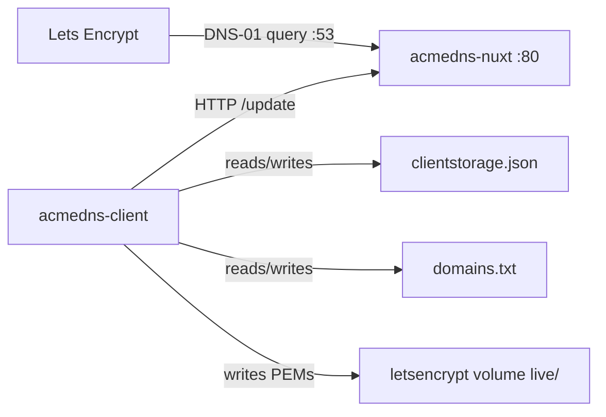

# ACME DNS stack

Two containers. One compose file. Certificates via DNS-01 without giving Let's Encrypt (or anyone) write access to your real DNS.

| Service | What it does |
| --- | --- |
| `acmedns-nuxt` | Nuxt/Node port of [acme-dns](https://github.com/acme-dns/acme-dns) — DNS on `:53` plus HTTP register/update (same SQLite/`config.cfg` as the Go tree) |
| `acmedns-client` | Nuxt 4 UI — `clientstorage.json`, `domains.txt` editor, ACME issue/renew into `/etc/letsencrypt` |

Compose gives `acmedns-nuxt` the network alias `acmedns-server` so `ACMEDNS_URL=http://acmedns-server` keeps working. The Go sources under `build/acmedns-server` remain for reference/rollback.



## Certificates in the client

Edit `data/acmedns-letsencrypt/domains.txt` on the host or in the **Certs** UI. **Save** validates format only. **Apply** runs ACME (DNS-01 via acme-dns).

- **Production** (default) writes `/etc/letsencrypt/live/<cert-name>/`
- **Staging** writes `/etc/letsencrypt/staging/<cert-name>/` and never touches `live/`
- A renew timer refreshes **production** certs within ~30 days of expiry
- Removing a line from `domains.txt` leaves PEMs on disk (orphans). Use **Trash** → Undo or permanent delete

Consumers bind the same Certbot-style paths:

```yaml
volumes:
  - letsencrypt:/etc/letsencrypt:ro
```

Upstream acme-dns only keeps two TXT records per account. This stack’s Nuxt server keeps **100 rolling TXT slots** (same as the vendored Go tree). Rebuild `acmedns-nuxt` when issuing many SANs on one account.

`domains.txt` expands nested wildcards (implied parent wildcards). Line order does not matter — shortest apex is the cert-name. Register the line apex in the UI; the issuer walks parent keys in `clientstorage.json`.

## Ports

### `acmedns-nuxt`

| Container | Host | Notes |
| --- | --- | --- |
| `53/tcp` | `53` | DNS. Let's Encrypt hits this. |
| `53/udp` | `53` | Same. |
| `80/tcp` | not published | Register/update API. Alias `http://acmedns-server`, or cloudflared. |

Leave `:80` off the host. DNS has to be public; the API does not.

This house’s router DMZ is the Synology, so public `:53` never reaches a Mac. **Test real Let's Encrypt issuance on the NAS**, not on a laptop. See [`.wiki/Test-on-Synology.md`](.wiki/Test-on-Synology.md). Working NAS runbook: [`.wiki/Working-Synology-setup.md`](.wiki/Working-Synology-setup.md).

### `acmedns-client`

| Container | Host | Notes |
| --- | --- | --- |
| `3000/tcp` | `82` | UI at `http://localhost:82`. Also on cloudflared if you want a hostname. |

## Quick start

```bash
cp .env.example .env
cp docker-compose.yml.example docker-compose.yml
cp docker-compose.override.yml.example docker-compose.override.yml
docker compose up -d --build
```

Docker creates `data/` for you. On first start the containers write:

- `data/acmedns-server/config/config.cfg`
- `data/acmedns-letsencrypt/domains.txt` (seeded by the client if missing)
- `clientstorage.json` on the `acmedns-client` volume (`{}` if empty)

1. `config.cfg` — your auth hostname, NS, admin, public IP.
2. `domains.txt` — one certificate per line. Edit in the Certs UI or on disk; Save validates; Apply issues. Example: `mdstn.com *.mdstn.com *.oib.mdstn.com *.admin.mdstn.com`. `#` and `;` start comments.
3. `.env` — at least `LETSENCRYPT_EMAIL`. For grouped SAN certs, rebuild `acmedns-nuxt` from this tree (100 TXT slots).
4. CNAME `_acme-challenge.<apex>` → `fulldomain` in `clientstorage.json`. Nested zones CNAME to `_acme-challenge.<apex>`.
5. You need the `cloudflared` Docker network (see `docker-compose.override.yml.example`).

If Docker created a *directory* named `domains.txt`, remove it (`rm -rf data/acmedns-letsencrypt/domains.txt`) and start again.

## Config

| File | |
| --- | --- |
| `.env` | Copy from `.env.example`. Gitignored. |
| `docker-compose.yml` | Copy from `docker-compose.yml.example`. Gitignored. |
| `docker-compose.override.yml` | Copy from `docker-compose.override.yml.example`. Gitignored. |
| `data/acmedns-server/config/config.cfg` | Listen address, zone, API. |
| `data/acmedns-letsencrypt/domains.txt` | What to issue (also edited in the Certs UI). |
| `clientstorage.json` (volume `acmedns-client`) | acme-dns logins. Not Let's Encrypt. |

### Environment (`.env` → `acmedns-client`)

| Variable | Example | |
| --- | --- | --- |
| `ACMEDNS_URL` | `http://acmedns-server` | API for registrations and DNS-01 updates. |
| `LETSENCRYPT_EMAIL` | `admin@example.com` | ACME account contact. |
| `RENEW_INTERVAL` | `12` | Hours between production renew checks. |
| `CERTS_ACME_ENABLED` | `true` | Set `false` to disable issue/renew (editor still works). |
| `TZ` | `UTC` | Clock. |

Set `ADMINISTRATOR_PASSWORD` to lock the UI behind username `admin`.

`NUXT_APPLICATIONS_DATA_ROOT` defaults to `/app/data` in Compose. Backups go to `/app/data/acmedns-client/backups`.

## Volumes

| Volume | Who | Inside the container |
| --- | --- | --- |
| `letsencrypt` | `acmedns-client` rw | `/etc/letsencrypt` (`live/`, `staging/`, `trash/`) |
| `acmedns-client` | `acmedns-client` rw | `/app/config` (`clientstorage.json`, cert settings) |
| `acmedns-client-data` | `acmedns-client` rw | `/app/data` |
| `./data/acmedns-server/config` | `acmedns-nuxt` | `/etc/acme-dns` |
| `./data/acmedns-server/data` | `acmedns-nuxt` | `/var/lib/acme-dns` |
| `./data/acmedns-letsencrypt` | `acmedns-client` | `/config/host` — `domains.txt` |

## Networks

Default compose network: both services. The client reaches the API as `http://acmedns-server` (network alias on `acmedns-nuxt`).

`cloudflared` (external): server and client. Port 53 stays on the host, not the tunnel.

More on DNS-01 and DMZ: [`.wiki/Home.md`](.wiki/Home.md).

## Layout

```
docker-compose.yml.example
docker-compose.override.yml.example
.env.example
.wiki/
build/acmedns-nuxt/        # Node/Nuxt acme-dns (DNS + API)
build/acmedns-server/      # Go reference / rollback
build/acmedns-client/
data/                      # gitignored
```
