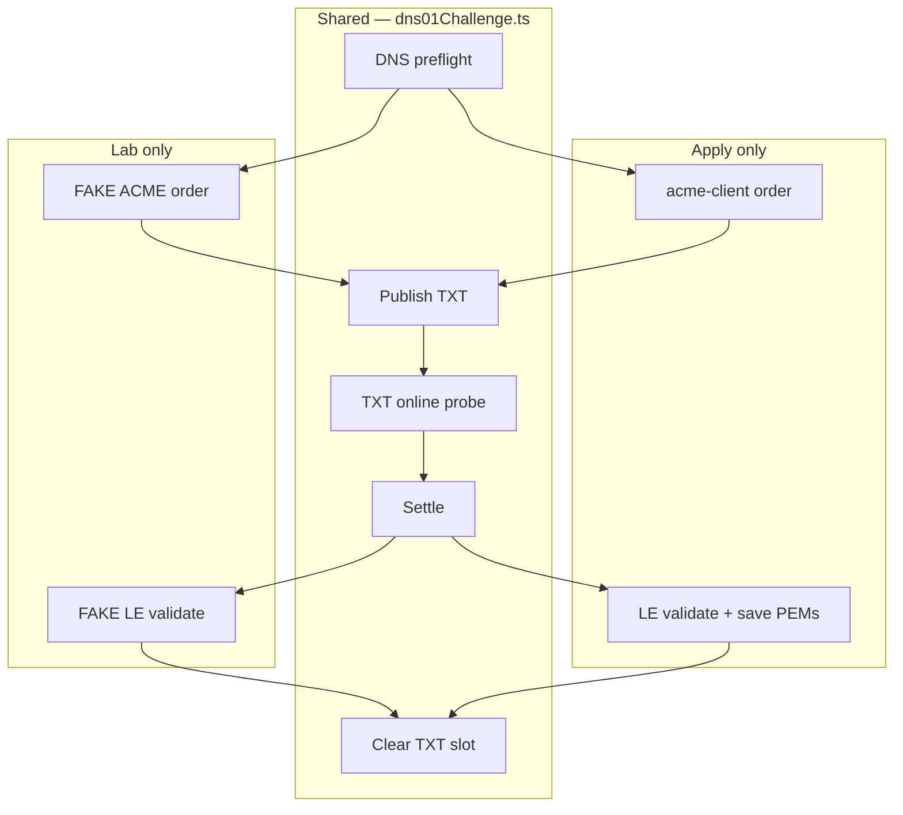
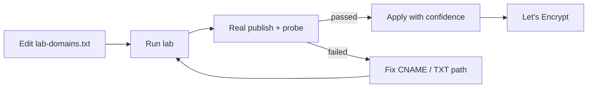

# After the merge: a DNS-01 lab, a UDP trap, and TXT that actually expires

In [the previous post](./from-two-services-to-one.md) I collapsed acme-dns and the operator UI into one Nuxt process. One container, one restart, in-process `/update` when the URL is local.

That solved **operations**. It did not solve **rehearsal**.

Every time I wanted to know whether `_acme-challenge` CNAMEs, TXT publish, and authoritative probing still worked, I had to **Apply** — real Let's Encrypt orders, real rate limits, real “why did only the wildcard fail?” at 22:00 on a Tuesday.

This post is about **`plugins/dns01-lab`**: a `/lab` route that runs the same DNS-01 pipeline as Certificates, fakes the ACME bits, shares the job queue so nothing publishes TXT twice, and — while building it — surfacing two bugs that also affected production Apply.

---

## What I wanted from a lab

Not a mock DNS server. Not a unit test with fixtures.

I wanted the **same code path** the operator already trusts:

1. Read a domains file
2. Preflight CNAMEs on authoritative nameservers
3. POST the dns-01 digest to acme-dns
4. Poll until TXT is visible where Let's Encrypt would look
5. Settle, then move on

Steps 1–4 and the settle pause should be **real**. Steps that talk to Let's Encrypt should be **fake** — local token generation, no `newOrder`, no validation callback.

And because Apply and Lab both call `/update` on the same shared auth zone, they must **never run at the same time**. One queue, one serial TXT publisher, same as before when Certbot lived in a third container.

---

## The lab as a Nuxt plugin

Same pattern as `plugins/client`:

```
build/acmedns-stack/
  plugins/dns01-lab/
    index.ts              ← defineNuxtModule, /lab route
    runtime/
      pages/lab/          ← operator UI
      server/utils/       ← lab-domains.txt, executor, fake ACME
      shared/             ← lab step labels (#lab-shared)
```

Registered next to the client module:

```ts
modules: ['./plugins/txt-ttl', './plugins/client', './plugins/dns01-lab']
```

**`lab-domains.txt`** mirrors `domains.txt` — one certificate line per row, same SAN expansion, same CNAME checks in the editor modal. **Copy from domains.txt** seeds the lab file when you want to rehearse exactly what you are about to Apply.

Lab jobs enter the **same certificate queue** with `source: 'lab'`. The UI shows `#42 lab` next to `#41 live`. While a lab job runs, Apply waits. While Apply runs, Run lab waits. That is not polish; it is correctness for shared-mode tiny labels where every apex hits one acme-dns account.

---

## Real steps vs fake steps

| Step | Lab | Apply |
| --- | --- | --- |
| DNS preflight (authoritative CNAME) | Real | Real |
| ACME order | **Fake** — local digests | Real — `acme-client` |
| Publish TXT (`/update`) | Real | Real |
| TXT online (authoritative probe) | Real | Real |
| DNS settle | Real | Real |
| LE validate | **Fake** — log and continue | Real |
| Save PEMs | Skipped | Real |

The fake order uses the same key-authorization → dns-01 digest rules as `acme-client`, so the TXT you publish in Lab is the TXT Apply would publish for the same names.



Extracting **`dns01Challenge.ts`** out of the cert executor was the payoff: one runner, two callers (`acmeIssue.ts` and `fakeAcmeIssue.ts`), one place to fix probe behaviour.

---

## The UDP trap: probes that lied

Lab failed at **TXT online** even though publish succeeded and `dig TXT` from my laptop showed the record.

The probe queries **authoritative nameservers** directly — the same path Let's Encrypt uses after following your CNAME. The answer was not NXDOMAIN. The code saw **no TXT strings** and kept polling until timeout.

Root cause: **UDP truncation**.

In shared tiny mode, one auth-zone label can accumulate many challenge digests. A single UDP response exceeded the classic 512-byte limit. `dns2` returned `NOERROR` with **zero parsed answers**. From the app's point of view that looks identical to “TXT not published yet.”

Fix: one line in the shared resolver — enable **TCP fallback for TXT queries only**:

```ts
retryOverTCP: type === 'TXT',
```

Certificates and Lab both call `runDns01Challenge` → `waitForChallengeTxtOnline` → `queryAuthoritative` → `dnsUdpQuery`. **One fix, both flows.** Lab did not invent a separate probe; it **found** a bug in the shared one.

A second edge case showed up in the same area: stale TXT at an intermediate CNAME hop while the current digest lived at the target name. The probe now follows CNAME when the hop has TXT but not the expected value — again in shared code, not lab-only.

---

## TXT that accumulates (and TXT that does not)

Public **auth.acme-dns.io** exposes `/update` only. There is no delete API. Old digests sit in one of two slots until overwritten. That is upstream behaviour; our stack cannot clean it remotely.

Locally, after the merge, challenge TXT lived in SQLite with **100 slots** per subdomain. Fine for multi-SAN wildcards. Less fine when you run Lab twenty times and your auth zone answers with a novel's worth of digests — which feeds straight back into the UDP problem above.

So **`plugins/txt-ttl`**:

- Challenge TXT moves to an **in-memory** store (plain `Map`, not Redis — this is one process)
- Default **24h TTL** per slot (`ACME_TXT_TTL_SECONDS`)
- After validate (or fake validate in Lab), **`clearDns01ChallengeTxt`** removes the digest that was just used
- Expired slots drop out of DNS answers on read; hourly purge cleans memory
- **Purge local TXT slots** on `/lab` for manual resets

SQLite keeps accounts and allow-from. Challenge TXT is ephemeral — closer to how you *wish* dns-01 worked.

Let's Encrypt still uses its own resolvers. We only control cleanup on **our** authoritative answers.

---

## Operator UX on `/lab`

The page deliberately rhymes with **Certificates**:

- Sticky bar: config cog, then **Run lab** / **Force run** grouped on the right
- Per-domain **Run** in the status table (green **passed**, red **failed**)
- Shared job panel and activity feed with a Lab filter
- Force run skips DNS preflight — same idea as Force re-issue on Apply

The goal is muscle memory: if Lab passes for a line, Apply is down to ACME account health and LE rate limits — not “did I typo the CNAME?”

---

## Before and after

**Before — production-only feedback:**


**After — rehearse, then Apply:**



---

## What stayed the same

- **`domains.txt`** is still the source of truth for real issuance
- **One job queue** — lab and live/staging never publish concurrently
- **Authoritative preflight** — Lab respects the same CNAME rules as Apply (unless Force run)
- **Remote `server_url`** — accounts on public acme-dns still POST over HTTP; we still cannot purge their TXT

---

## What got better

**Cheaper mistakes.** Multi-SAN lines, new apex, shared tiny label — exercise the whole TXT path without an LE order.

**Shared infrastructure surfaced early.** Probe TCP fallback and CNAME-follow logic landed in `dns01Challenge` / `challengeTxtOnline`, not in a lab silo.

**TXT lifecycle matches intent.** Publish, prove, validate, clear — plus TTL as a safety net when something aborts mid-job.

**Plugin pattern scales.** Client, txt-ttl, dns01-lab — each module owns a slice; the host stays the DNS API and process wrapper.

---

## Closing thought

Collapsing to one container removed the HTTP hop between UI and `/update`. The lab removes the **Let's Encrypt hop from rehearsal** — without faking the parts that actually break in production (CNAME, publish, authoritative TXT).

If `/lab` passes and Apply fails, you are probably looking at ACME policy, account limits, or staging vs production — not DNS voodoo.

That is the point.

---

*Previously: [From two containers to one](./from-two-services-to-one.md).*  
*Stack: [HariantoAtWork/acmedns-stack](https://github.com/HariantoAtWork/acmedns-stack) — branch `feat/dns01-lab`.*
