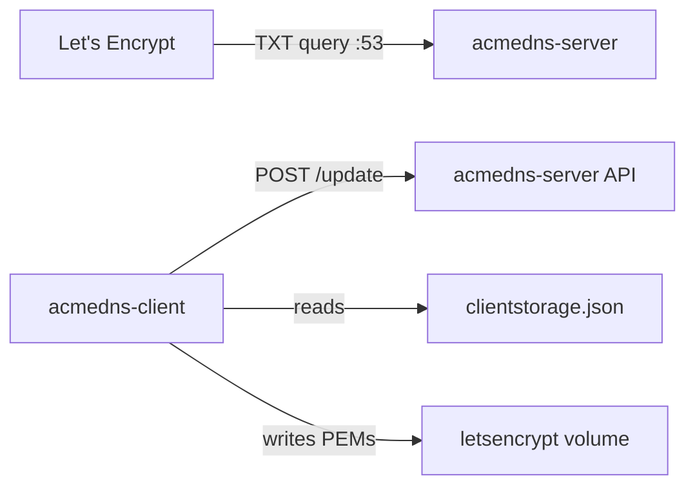
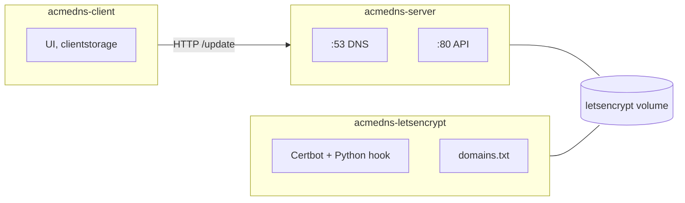
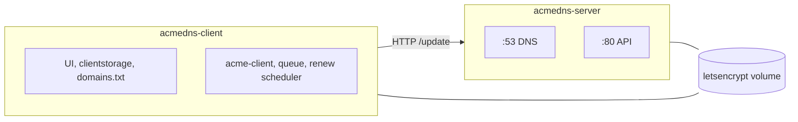

# From three containers to two: folding Certbot into the acme-dns client

For a while my homelab stack ran **three** Docker services to get Let's Encrypt certificates via DNS-01:

1. **acmedns-server** — the DNS server and HTTP API
2. **acmedns-client** — the Nuxt UI for registrations and `clientstorage.json`
3. **acmedns-letsencrypt** — a custom Certbot image with a Python auth hook

That worked. It also meant three images to build, three restart policies to reason about, and a gap between “edit domains” and “issue certs” that lived in different places.

This post is about collapsing the third container into the client — and what you gain when certificate logic lives next to the UI that already owns your acme-dns credentials.

---

## What DNS-01 with acme-dns looks like

Let's Encrypt proves you control a domain by asking for a TXT record at `_acme-challenge.example.com`. With [acme-dns](https://github.com/acme-dns/acme-dns), you delegate that name to a small DNS server you run. Your real DNS only needs a CNAME; the acme-dns API accepts TXT updates during issuance.

The flow:

Nothing here *requires* Certbot. Something has to speak ACME and something has to POST the TXT token. Those two jobs can live in one process.

---

## Why there were three services

### 1. acmedns-server

Unchanged in role: authoritative DNS for your challenge zone, SQLite-backed accounts, HTTP API on port 80 inside the compose network.

I vendor a fork with **100 rolling TXT slots** per account (upstream defaults to two). That matters when one certificate covers several wildcards on a shared acme-dns account.

### 2. acmedns-client

Registers hostnames, stores usernames and passwords in `clientstorage.json`, helps you build the CNAME chain, and backs up config. It was always the human-facing layer.

### 3. acmedns-letsencrypt

This existed because **off-the-shelf Certbot plugins did not fit**.

The stock `certbot-dns-acmedns` path assumes a different integration model. My setup stores credentials per apex in `clientstorage.json`, walks parent keys for nested wildcards, and posts to a local `http://acmedns-server` URL. That logic lived in a **custom Python auth hook** (`acme-dns-auth.py`), plus:

- **`domains.txt`** — one certificate per line, SAN expansion, comment lines
- **`domains.py`** — parse lines into Certbot `-d` flags and cert names
- **`renew.sh`** — cron-style production renewals

Certbot wrote PEMs to `/etc/letsencrypt/live/`. The server container mounted that volume read-only when it needed TLS material. The client mounted `clientstorage.json`. The letsencrypt container needed **both** — credentials and the cert tree — plus the hook scripts baked into its own image.

Three services, three concerns, one workflow split across container boundaries.

---

## The friction of three

**Split brain.** Domains lived in `domains.txt` on a host path. Credentials lived in a Docker volume the UI owned. Issuance lived in a third container. Changing a line and applying a cert meant trusting that all three agreed on paths, mounts, and timing.

**Opaque runs.** Certbot logged to container stdout. The UI had no idea a renew was running, which cert was current, or why a batch failed halfway through. You `docker logs` and hope.

**Operational overhead.** Another Dockerfile, another entrypoint, another “why did renew not fire?” thread. On a Synology NAS where this stack actually runs (public `:53` has to land on the machine that owns DNS), every extra moving part counts.

**Staging was awkward.** Trying Let's Encrypt staging without touching production certs meant careful Certbot flags and directory layout — not something you flip in a UI.

None of this was fatal. It was just **more stack than the problem needed**.

---

## The move: ACME inside acmedns-client

The third service is gone. Compose is now:

| Service | Role |
| --- | --- |
| `acmedns-server` | DNS + API |
| `acmedns-client` | UI + ACME issue/renew + `domains.txt` editor |

Certificate work uses **`acme-client`** in Node/Bun, not a Certbot subprocess. The DNS-01 hook path is the same idea as the Python script: read credentials from `clientstorage.json`, POST to acme-dns, wait for propagation, complete the order.

### What stayed the same

- **`domains.txt`** is still the source of truth — host path `./data/acmedns-letsencrypt/domains.txt`, edited on disk or in the **Certs** UI
- **Certbot-compatible layout** — production PEMs under `/etc/letsencrypt/live/<cert-name>/`, staging under `staging/`
- **Shared `letsencrypt` volume** — client writes, server reads (read-only)
- **DNS-01 via acme-dns** — no write access to your real DNS provider
- **Production renew timer** — background checks on an interval (`RENEW_INTERVAL`, default 12 hours)

Any consumer that already mounted `letsencrypt:/etc/letsencrypt:ro` keeps working.

### What got better

**One place to work.** Save validates `domains.txt`. Apply enqueues ACME. Staging vs production is a toggle for the *next* job. Orphans go to **Trash** with undo.

**A job queue, not fire-and-forget.** Each Apply or renew is a FIFO session with **mode pinned at enqueue time** — switching staging/production mid-queue does not corrupt a running batch. Cancel, resume, delete from the UI.

**Observability.** An activity log, step-by-step Let's Encrypt communication logs, refresh, and an SSE live stream (with polling fallback) so the status dot matches what you see happening.

**Fewer images.** `docker compose up` builds server + client. No third certbot tree.

---

## Before and after

**Before — three containers:**

**After — two containers:**

Same volume. Same DNS path. One fewer box on the diagram.

---

## A note on where this runs

DNS-01 is not “works on my laptop” friendly if public port 53 does not reach your machine. The hook succeeding over HTTP does not mean Let's Encrypt can see your TXT record. I run this on a Synology behind a router DMZ; the wiki documents that split explicitly.

Collapsing Certbot into the client did not change that constraint. It changed **how much software sits between you and a green cert**.

---

## Closing thought

The third service existed for good reasons: Certbot's plugin ecosystem did not match my credential model, and a hook in Python was the pragmatic choice at the time.

Once the client already owned credentials, domain editing, and the operator's attention, a separate Certbot container became **integration glue** — mounts and scripts holding the same data the app already had in memory.

Moving ACME into the client is not “replace Certbot because Certbot is bad.” It is **put issuance where the rest of the workflow already lives**, keep the on-disk layout your reverse proxies expect, and trade a container for a composable you can log, queue, and stream.

Two services. One compose file. Certificates without giving Let's Encrypt write access to your real DNS.

---

*Next: [From two containers to one](./from-two-services-to-one.md).*  
*Stack: [HariantoAtWork/dns01-proxy](https://github.com/HariantoAtWork/dns01-proxy) — branch `feat/node-letsencrypt-client`.*
