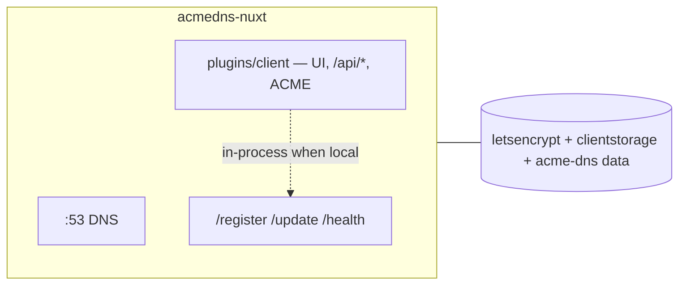
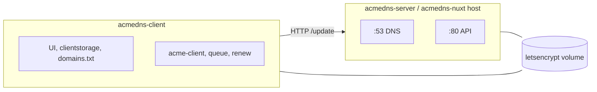
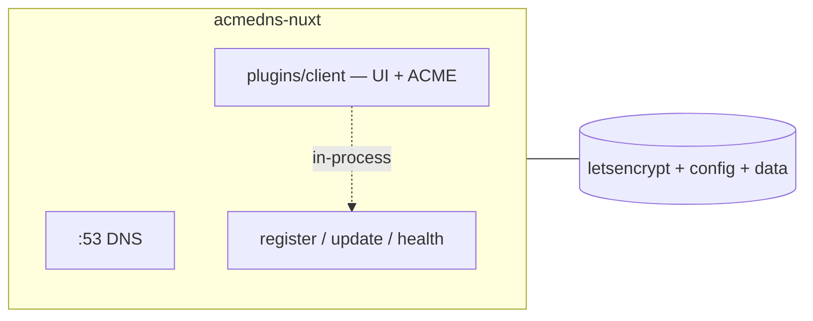

# From two containers to one: acme-dns and the operator UI in a single Nuxt process

In [the previous post](./from-three-services-to-two.md) I folded Certbot into the Nuxt client. That left **two** Compose services:

1. **acmedns-server** — authoritative DNS on `:53` and the HTTP API (`/register`, `/update`, `/health`)
2. **acmedns-client** — operator UI, `clientstorage.json`, ACME issue/renew, `domains.txt`

Two boxes was already better than three. It was still a split between “the DNS thing” and “the app that talks to the DNS thing.”

This post is about collapsing that last boundary — and why the answer was not “stuff everything into one Dockerfile,” but **port the server into Nuxt, then attach the client as a local plugin**.

---

## Why two still felt like too many

**Cross-container HTTP for the hot path.** Every registration and every DNS-01 TXT update was `$fetch` from the client container to the server container. Same Docker network, same machine, still a network hop, still URL config, still failure modes that look like “API down” when the real issue is compose DNS names or TLS on the wrong port.

**Two images, two rebuilds.** UI tweak? Rebuild client. DNS bug? Rebuild server. Synology cutovers meant reasoning about both services restarting, both healthchecks, and whether the shared volumes still lined up.

**Shared volumes without shared process.** The server mounted `letsencrypt` read-only for TLS material. The client wrote PEMs and owned `clientstorage`. Correct, but you still had to keep the mount table honest across two service definitions.

**The Go binary was fine.** Upstream-style Go acme-dns (with my 100 TXT-slot fork) did its job. The friction was not “Go is wrong” — it was **two runtimes for one workflow**.

None of that forced a rewrite. It made “what if DNS and UI were the same process?” worth answering.

---

## Step one: clone the server into Nuxt

Before merging the client, I replaced the Go container with a wire-compatible Nuxt/Node port: **`acmedns-nuxt`**.

Goals for that port:

- DNS on `:53` (UDP + TCP)
- `POST /register`, `POST /update`, `GET /health`
- Same SQLite schema and **100 rolling TXT slots** per account
- Same `config.cfg` and data directories (`/etc/acme-dns`, `/var/lib/acme-dns`) so Synology volumes did not need a migration
- Compose network alias **`acmedns-server`** so the still-separate client could keep its URL

That mattered: the client merge could wait until DNS behaviour matched. Rollback stayed on the Go tree under `build/acmedns-server`.

At that point compose was still two services — but both were Node/Bun/Nuxt-shaped, and the server no longer lived in a different language.

---

## Step two: the client as a local Nuxt plugin

The operator app did not dissolve into `server/`. It moved under:

```
build/acmedns-nuxt/
  server/                 ← acme-dns only (DNS + register/update/health)
  plugins/client/
    index.ts              ← defineNuxtModule
    runtime/
      plugin.ts           ← defineNuxtPlugin
      server/api|utils/…  ← /api/*, ACME, clientstorage, backups
      pages|components/…  ← UI
```

That layout matches how I already structure local Nuxt modules elsewhere: **module at `plugins/<name>/index.ts`, runtime under `runtime/`**, registered as:

```ts
modules: ['./plugins/client']
```

The host stays boring. The plugin owns pages, `/api/*`, cert queue, renew scheduler, and auth. Boundaries are file-tree boundaries, not container boundaries.

### In-process register and update

When `ACMEDNS_URL` points at this stack (loopback, compose name, or the auth zone this process serves), the plugin does **not** HTTP to itself. It calls the host DB helpers in-process — `registerAccount`, TXT update — then still stores a **public** `server_url` on the account so CNAME recipes and UI copy show the identity operators expect, not `http://127.0.0.1`.

Remote URL? Still `$fetch`. Same code path, two transports.

That removes the last silly failure mode from a single-host deploy: Cloudflare or TLS in front of the public name must not be required for the container to update its own TXT records.

---

## Compose after the merge

One service:

| Service | Role |
| --- | --- |
| `acmedns-nuxt` | DNS `:53`, acme-dns HTTP (and optional HTTPS), UI, `/api/*`, ACME, clientstorage |

Ports and volumes are the union of what used to be split: DNS, API, config, SQLite, `clientstorage`, `letsencrypt`, host `domains.txt`. Cap `NET_BIND_SERVICE` stays — something still has to bind `:53`.



No second box. No HTTP hop on the local path. Same PEM layout reverse proxies already mount.

---

## What stayed the same

- **`domains.txt`** — still the cert source of truth
- **Certbot-compatible PEMs** — `live/`, `staging/`, trash/last-saved workflows in the UI
- **DNS-01 via acme-dns** — no write access to your real DNS provider; CNAMEs still one-time at the apex
- **100 TXT slots** — multi-SAN wildcards on a shared account still work
- **Synology / public `:53`** — collapsing containers does not move your IP; Let's Encrypt still has to query *your* authoritative answers

If you already consumed the `letsencrypt` volume read-only from another stack, you keep doing that. Only the writer changed address: one container instead of two.

---

## What got better

**One image to build and push.** Operator UI and DNS ship together. Cutover is “replace the two services with this one,” not a three-way volume story.

**One process for the workflow.** Edit domains, apply certs, register accounts, update TXT — same logs, same restart, same health surface.

**Clear module boundary.** Want to reason about ACME? `plugins/client`. Want to reason about DNS auth? `server/`. That is easier to review than “everything in `server/api`” *and* easier to operate than two containers.

**Fewer lies in the diagram.** The architecture drawing finally matches how the stack feels day to day: one place you SSH to, one compose service, one set of mounts.

---

## Before and after

**Before — two containers:**



**After — one container:**



---

## Closing thought

Three to two was about **putting issuance next to credentials**. Two to one was about **putting credentials next to the DNS that stores the challenges**.

The Go server was not the villain. A separate client container was not a mistake. Each step solved the pain that was loudest at the time: first Certbot’s plugin mismatch, then cross-container glue for a workflow that always belonged in one place.

One Nuxt process. Host DNS API, plugin for the operator. Same `domains.txt`, same PEM tree, same DNS-01 story — fewer moving parts between “save” and “green cert.”

---

*Previously: [From three containers to two](./from-three-services-to-two.md).*  
*Stack: [HariantoAtWork/acmedns-stack](https://github.com/HariantoAtWork/acmedns-stack) — branch `feat/acmedns-nuxt`.*
