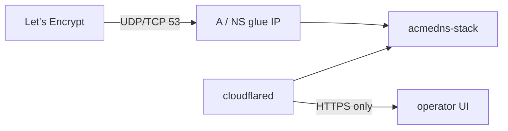
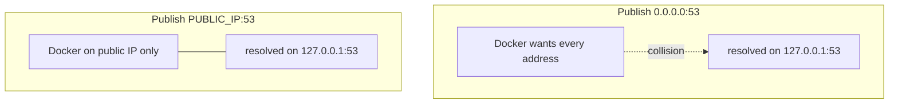

# Port 53 without host networking: bind the public IP

One container. Authoritative DNS on `:53`. That part is settled — see [from two to one](./from-two-services-to-one.md).

What bit me next was **publishing** 53 from Docker on a VPS.

At home it was already fine: router **DMZ** to the Synology, Compose `53:53`, glue on the public WAN IP. On a cheap VPS with one address, plain `53:53` failed. `network_mode: host` worked. The durable fix was narrower: publish DNS as `PUBLIC_IP:53` only and leave `127.0.0.1:53` to systemd-resolved.

---

## The constraint that never moves

Let's Encrypt DNS-01 hits **UDP and TCP 53** on the IP in your NS/A glue. No port field. No Cloudflare Tunnel. No “map 5353 to 53 and hope LE notices.”

So something on the public address must own `:53`. Everything else — UI on 1080, edge on 80/443, cloudflared for HTTPS hostnames — can share the machine. Port 53 cannot share with another resolver on the **same** address.



---

## Two setups that work

### Synology + DMZ

Router sends unsolicited inbound traffic (including UDP/TCP 53) to the NAS. Compose publishes `53:53` / `53:53/udp`. Glue points at the home public IP. No special Docker network driver required.

See [`.wiki/Test-on-Synology.md`](../.wiki/Test-on-Synology.md) and [`.wiki/Working-Synology-setup.md`](../.wiki/Working-Synology-setup.md).

### VPS (one public IP)

The NIC address **is** the public IP. `ports: ["53:53"]` asks Docker for **`0.0.0.0:53`** — every address, including loopback. On many Ubuntu/Debian images, **systemd-resolved** already holds **`127.0.0.1:53`**. Collision.

Host networking sidesteps Docker’s publish path. It works; it also dumps the service into the host namespace.

Binding only the public address does not:

```yaml
ports:
  - "YOUR_VPS_IP:53:53"
  - "YOUR_VPS_IP:53:53/udp"
```

| Publish | Meaning | Result here |
| --- | --- | --- |
| `53:53` / `0.0.0.0:53` | All interfaces | Failed (resolved on localhost:53) |
| `YOUR_IP:53:53` | That IP only | **Worked** |
| `network_mode: host` | Process on the host | Worked (overkill) |



---

## What we added: `vps.yml` + `docker:vps`

Optional Compose file — opt-in with `-f`, `ports: !override` so base `53:53` is replaced instead of appended:

```yaml
services:
  acmedns-stack:
    ports: !override
      - "${PUBLIC_IP}:53:53"
      - "${PUBLIC_IP}:53:53/udp"
      - "80:80"
      - "443:443"
      - "1080:1080"
      - "1443:1443"
```

`package.json` detects the default IPv4 route `src` (override with `PUBLIC_IP=…`):

```bash
bun run docker:vps
# bun run docker:vps:down
# bun run docker:vps:restart
```

Under the hood that is roughly:

```bash
PUBLIC_IP=${PUBLIC_IP:-$(ip -4 route get 1.1.1.1 | sed -n 's/.* src \([0-9.]*\).*/\1/p')} \
  docker compose -f docker-compose.yml \
    $([ -f docker-compose.override.yml ] && echo -f docker-compose.override.yml) \
    -f vps.yml up -d
```

Use the **local** address from the route table for the bind — on a 1:1 VPS it matches the public IP, and Docker will refuse an address that is not on the host. Echo services (`icanhazip`, ipify) are fine for glue detection inside the app (`ACMEDNS_PUBLIC_IP`); they are the wrong primary source for **which socket to open**.

Operator notes: [`.wiki/VPS-port-53.md`](../.wiki/VPS-port-53.md).

---

## Choosing a path

| Situation | Use |
| --- | --- |
| Home Synology, DMZ / forward 53 to the NAS | Normal `docker compose up` (`53:53`) |
| VPS, one public IP, resolved on localhost:53 | `bun run docker:vps` |
| You already use host networking and like it | Keep it — not wrong, just not required |

---

## What this is not

- **Not** a substitute for opening UDP/TCP 53 in the provider firewall (or DMZ at home).
- **Not** a way to put DNS behind cloudflared — tunnels still do not carry 53.
- **Not** the same as `ACMEDNS_PUBLIC_IP` — that env pins **glue records** in tiny mode; `PUBLIC_IP` in Compose is only the **publish bind**.

---

## Closing thought

Host networking fixed the VPS symptom by skipping Docker’s publish path. The honest publish is narrower: **bind the address Let's Encrypt already has in glue, and leave loopback to resolved.**

At home, honesty is DMZ to the box that runs acme-dns. Same glue story, different NAT.

---

*Previously: [After the merge: a DNS-01 lab…](./dns01-lab-and-txt-probe.md).*  
*Wiki: [VPS port 53](../.wiki/VPS-port-53.md) · [Test this stack on the Synology](../.wiki/Test-on-Synology.md).*
*Stack: [HariantoAtWork/acmedns-stack](https://github.com/HariantoAtWork/acmedns-stack).*
